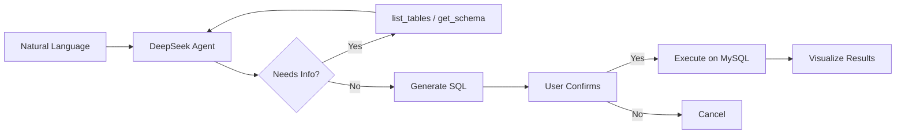

<p align="center">
  <h1 align="center">DeepSeek DB Chat</h1>
</p>

<p align="center">
  An AI-powered MySQL assistant with DeepSeek-native optimization — natural language to SQL, real-time thinking visualization, human-in-the-loop safety, and automatic data visualization.
</p>

<p align="center">
  <a href="./LICENSE"></a>
  
  
  
</p>

<p align="center">
  <b><a href="./README.zh-CN.md">中文文档</a></b> · <b><a href="./docs/getting-started.md">Documentation</a></b>
</p>

---

## Why DeepSeek DB Chat?

General-purpose AI database tools rely on universal LLM SDKs that ignore DeepSeek's unique thinking mode and caching mechanisms. DeepSeek DB Chat is purpose-built for DeepSeek, solving problems other tools cannot.

### 🧠 WYSIWYG Thinking & Tool Calling

DeepSeek's thinking mode outputs a chain of thought (`reasoning_content`) before generating SQL. **DeepSeek DB Chat** renders the entire thinking process in real time — thinking blocks, tool calls, and final answers stream live. **What you see is what the AI thinks** — full transparency, zero black box.

The agent automatically tracks and re-sends `reasoning_content` across multi-turn tool calls, with differentiated strategies to avoid the 400 errors that break general-purpose frameworks.

### 🔒 Human-in-the-Loop SQL Safety

Every generated SQL query is presented to you for review **before** execution. No SQL runs without your explicit confirmation. Dangerous operations (INSERT / UPDATE / DELETE / DROP) are clearly flagged with warnings. Your database is never at risk from hallucinated queries.

### 💾 Cost Optimization & Maximum Cache Hit Rate

Zero-redundancy request bodies with deterministic message construction ensure maximum DeepSeek cache hit rates. Combined with auto-retry, exponential backoff, and intelligent timeout mechanisms, you get reliable performance at the lowest possible cost.

---

## Features

- 🧠 **Real-Time Thinking Visualization** — Watch the AI reason step by step: thinking, tool calls, and answers stream live — WYSIWYG
- 🔒 **Human-in-the-Loop SQL** — Every SQL query requires your confirmation before execution — no surprises
- 🔐 **100% Privacy** — All chat history stays in your browser's localStorage. **No login, no registration, no server-side data storage**
- 📊 **Beautiful Data Visualization** — Query results automatically rendered as interactive tables and charts (bar / line / pie)
- 💾 **DeepSeek Cost Optimization** — Zero-redundancy requests, deterministic message construction, maximum cache hit rate
- 🔄 **Resilient Execution** — Auto-retry with exponential backoff, configurable timeouts, and smart error recovery
- 🗄️ **Multi-Database Management** — Add, switch, and manage multiple MySQL connections from the sidebar
- 🤖 **Intelligent Agent Loop** — Multi-step reasoning: list tables → inspect schema → generate SQL → confirm → execute
- ✍️ **Thinking Mode by Default** — `reasoning_content` properly managed across multi-turn tool calls — zero configuration
- 💬 **SSE Streaming** — Real-time response delivery via Server-Sent Events for instant feedback

---

<!-- ## Demo

> Add screenshot or GIF here

--- -->

## Quick Start

### Prerequisites

- Node.js >= 18.0.0
- pnpm
- A MySQL database

### 1. Clone & Install

```bash
git clone https://github.com/annoyc/deepseek-db-chat.git
cd deepseek-db-chat
pnpm install
```

### 2. Run

```bash
pnpm dev
```

Open [http://localhost:3000](http://localhost:3000), configure your DeepSeek API key in the settings dialog, and start chatting with your database.

> You can also set `DEEPSEEK_API_KEY` in a `.env` file if you prefer — see [Configuration](#configuration).

---

## How It Works



The agent follows a **ReAct loop** (Reasoning + Acting):

1. **Understand** — Parse the natural language question
2. **Explore** — Use `list_tables` and `get_table_schema` tools to discover the database structure
3. **Generate** — Write precise SQL based on confirmed field names and types
4. **Confirm** — Present SQL to the user with an explanation for approval
5. **Execute** — Run the confirmed SQL and display results as tables or charts
6. **Continue** — If more data is needed, the agent continues with additional queries

---

## Tech Stack

| Layer | Technology |
|-------|------------|
| **Framework** | [TanStack Start](https://tanstack.com/start) + [TanStack Router](https://tanstack.com/router) |
| **AI Core** | DeepSeek Agent Engine (based on [deepseek-kit](https://github.com/FliPPeDround/deepseek-kit)) |
| **Database** | [mysql2](https://github.com/sidorares/node-mysql2) |
| **UI** | React 19 + [Tailwind CSS v4](https://tailwindcss.com/) + [Lucide Icons](https://lucide.dev/) |
| **Charts** | [Recharts](https://recharts.org/) |
| **Markdown** | [react-markdown](https://github.com/remarkjs/react-markdown) + [remark-gfm](https://github.com/remarkjs/remark-gfm) |
| **Validation** | [Zod](https://zod.dev/) |
| **Streaming** | Server-Sent Events (SSE) |
| **Build** | [Vite](https://vite.dev/) |

---

## Project Structure

```
src/
├── core/               # DeepSeek Agent engine
│   ├── agent/          # Agent creation and execution
│   ├── client/         # HTTP client, SSE streaming, retry
│   ├── model/          # DeepSeek model wrapper
│   ├── tool/           # Tool definition and validation
│   ├── generate/       # Agent loop, streaming, structured output
│   ├── context/        # Context compaction
│   └── index.ts        # Public API exports
├── server/             # Server-side logic
│   ├── agent.ts        # DB Agent configuration & system prompt
│   ├── tools.ts        # Database tools (list_tables, get_schema, execute_sql)
│   ├── database.ts     # MySQL connection pool management
│   └── functions/      # TanStack server functions (chat, connections)
├── components/         # React components
│   ├── chat/           # Chat UI (messages, SQL confirm, charts, thinking)
│   └── layout/         # Sidebar, dialogs, database list
├── hooks/              # React hooks (useChat, useDatabase, useSettings)
├── lib/                # Types, constants, utilities
├── routes/             # TanStack Router pages
└── styles/             # Global CSS (Tailwind)
```

---

## Configuration

### API Key

Configure your DeepSeek API key via either:

- **In-app settings dialog** (recommended) — click the settings icon in the sidebar
- **Environment variable** — create a `.env` file:

```bash
cp .env.example .env
```

```env
DEEPSEEK_API_KEY=your_api_key_here
```

> Get your API key at [platform.deepseek.com](https://platform.deepseek.com/api_keys)

### Environment Variables

| Variable | Required | Description |
|----------|----------|-------------|
| `DEEPSEEK_API_KEY` | No | DeepSeek API key (can be set via in-app dialog instead) |
| `DEEPSEEK_API_BASE_URL` | No | Custom API base URL (default: `https://api.deepseek.com`) |
| `DB_HOST` | No | Default MySQL host |
| `DB_PORT` | No | Default MySQL port |
| `DB_USER` | No | Default MySQL user |
| `DB_PASSWORD` | No | Default MySQL password |
| `DB_DATABASE` | No | Default MySQL database name |

### Model Selection

Two models available, switchable from the sidebar:

- **deepseek-v4-flash** (default) — Fast responses, lower cost
- **deepseek-v4-pro** — Higher reasoning quality

---

## Roadmap

- [ ] PostgreSQL / SQLite support
- [ ] Query history and saved queries
- [ ] Export results to CSV / Excel
- [ ] Dark mode
- [ ] Docker deployment
- [ ] Multi-language support (i18n)
- [ ] MCP (Model Context Protocol) integration

---

## Contributing

Contributions are welcome! Please feel free to submit a Pull Request.

1. Fork the repository
2. Create your feature branch (`git checkout -b feature/amazing-feature`)
3. Commit your changes (`git commit -m 'Add some amazing feature'`)
4. Push to the branch (`git push origin feature/amazing-feature`)
5. Open a Pull Request

---

## License

[MIT](./LICENSE) License © [annoyc](https://github.com/annoyc)

The AI agent core (`src/core/`) is based on [deepseek-kit](https://github.com/FliPPeDround/deepseek-kit) by [Flippedround](https://github.com/flippedround), MIT License.
