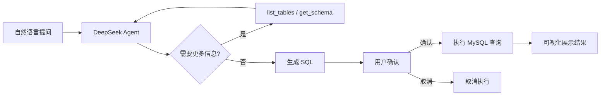

<p align="center">
  <h1 align="center">DeepSeek DB Chat</h1>
</p>

<p align="center">
  The DeepSeek-native chat2sql Agent
</p>

<p align="center">
  自然语言转 SQL，实时思考过程可视化，人工确认安全机制，极致美观的数据可视化。
</p>

<p align="center">
  <a href="./LICENSE"></a>
  
  
  
</p>

<p align="center">
  <b><a href="./README.md">English</a></b> · <b><a href="./docs/getting-started.md">文档</a></b>
</p>

---

## 为什么选择 DeepSeek DB Chat？

通用 AI 数据库工具依赖通用大模型 SDK，无法正确处理 DeepSeek 独有的思考模式和缓存机制。DeepSeek DB Chat 针对 DeepSeek 从底层深度优化，解决了其他工具无法解决的问题。

### 🧠 所见即所得的思考 & 精准工具调用

DeepSeek 思考模式会在生成 SQL 前输出思维链（`reasoning_content`）。**DeepSeek DB Chat** 将整个思考过程实时渲染 — 思考过程、工具调用、最终回答全程流式展示。**AI 想什么，你就看到什么** — 全程透明，零黑盒。

Agent 在多轮工具调用中自动追踪并回传 `reasoning_content`，采用差异化策略，避免通用框架常见的 400 错误。

### 🔒 Human-in-the-Loop SQL 安全机制

所有生成的 SQL 查询都会在执行**之前**呈现给你审查。没有你的明确确认，任何 SQL 都不会执行。危险操作（INSERT / UPDATE / DELETE / DROP）会被清晰标注警告。你的数据库永远不会被幻觉查询所伤害。

### 💾 DeepSeek 成本压缩 & 极致缓存命中

零冗余请求体 + 确定性消息构建，确保 DeepSeek 缓存命中率最大化。配合自动重试、指数退避和智能超时机制，以最低成本获得可靠的性能表现。

---

## 核心特性

- 🧠 **实时思考过程可视化** — AI 推理全程可见：思考过程、工具调用、最终回答实时流式展示，所见即所得
- 🔒 **SQL 安全执行** — 每条 SQL 都需要你确认后才会执行，杜绝意外操作
- 🔐 **100% 隐私保护** — 所有聊天记录存储在浏览器 localStorage 中。**无需登录注册，无任何服务端数据存储**
- 📊 **极致美观的数据可视化** — 查询结果自动渲染为交互式表格和图表（柱状图 / 折线图 / 饼图）
- 💾 **DeepSeek 成本优化** — 零冗余请求体 + 确定性消息构建，最大化缓存命中率，降低 API 费用
- 🔄 **弹性执行机制** — 自动重试 + 指数退避 + 可配置超时 + 智能错误恢复
- 🗄️ **多数据库管理** — 在侧边栏添加、切换、管理多个 MySQL 连接
- 🤖 **智能 Agent 循环** — 多步推理：列出表 → 查看结构 → 生成 SQL → 确认 → 执行
- ✍️ **默认思考模式** — `reasoning_content` 在多轮工具调用中正确管理，零配置即可工作
- 💬 **SSE 流式传输** — 基于 Server-Sent Events 的实时响应，即时反馈

---

<!-- ## 演示

> 在此添加截图或 GIF

--- -->

## 快速开始

### 环境要求

- Node.js >= 18.0.0
- pnpm
- MySQL 数据库

### 1. 克隆 & 安装

```bash
git clone https://github.com/annoyc/deepseek-db-chat.git
cd deepseek-db-chat
pnpm install
```

### 2. 启动

```bash
pnpm dev
```

打开 [http://localhost:3000](http://localhost:3000)，在设置对话框中配置你的 DeepSeek API 密钥，即可开始与数据库对话。

> 你也可以在 `.env` 文件中设置 `DEEPSEEK_API_KEY` — 详见[配置说明](#配置说明)。

---

## 工作原理



Agent 遵循 **ReAct 循环**（推理 + 行动）：

1. **理解** — 解析自然语言问题
2. **探索** — 使用 `list_tables` 和 `get_table_schema` 工具发现数据库结构
3. **生成** — 基于确认过的真实字段名和类型编写精确 SQL
4. **确认** — 将 SQL 和说明呈现给用户审批
5. **执行** — 运行确认后的 SQL，以表格或图表展示结果
6. **延续** — 如需更多数据，Agent 继续执行后续查询

---

## 技术栈

| 层级 | 技术 |
|------|------|
| **框架** | [TanStack Start](https://tanstack.com/start) + [TanStack Router](https://tanstack.com/router) |
| **AI 核心** | DeepSeek Agent Engine（基于 [deepseek-kit](https://github.com/FliPPeDround/deepseek-kit)） |
| **数据库** | [mysql2](https://github.com/sidorares/node-mysql2) |
| **UI** | React 19 + [Tailwind CSS v4](https://tailwindcss.com/) + [Lucide Icons](https://lucide.dev/) |
| **图表** | [Recharts](https://recharts.org/) |
| **Markdown** | [react-markdown](https://github.com/remarkjs/react-markdown) + [remark-gfm](https://github.com/remarkjs/remark-gfm) |
| **校验** | [Zod](https://zod.dev/) |
| **流式传输** | Server-Sent Events (SSE) |
| **构建** | [Vite](https://vite.dev/) |

---

## 项目结构

```
src/
├── core/               # DeepSeek Agent 引擎
│   ├── agent/          # Agent 创建与执行
│   ├── client/         # HTTP 客户端、SSE 流式请求、重试
│   ├── model/          # DeepSeek 模型封装
│   ├── tool/           # 工具定义与校验
│   ├── generate/       # Agent 循环、流式生成、结构化输出
│   ├── context/        # 上下文压缩
│   └── index.ts        # 公共 API 导出
├── server/             # 服务端逻辑
│   ├── agent.ts        # 数据库 Agent 配置 & 系统提示词
│   ├── tools.ts        # 数据库工具（list_tables, get_schema, execute_sql）
│   ├── database.ts     # MySQL 连接池管理
│   └── functions/      # TanStack Server Functions（聊天、连接管理）
├── components/         # React 组件
│   ├── chat/           # 聊天 UI（消息、SQL 确认、图表、思考过程）
│   └── layout/         # 侧边栏、对话框、数据库列表
├── hooks/              # React Hooks（useChat, useDatabase, useSettings）
├── lib/                # 类型、常量、工具函数
├── routes/             # TanStack Router 页面
└── styles/             # 全局 CSS（Tailwind）
```

---

## 配置说明

### API 密钥

通过以下任一方式配置 DeepSeek API 密钥：

- **应用内设置对话框**（推荐）— 点击侧边栏的设置图标
- **环境变量** — 创建 `.env` 文件：

```bash
cp .env.example .env
```

```env
DEEPSEEK_API_KEY=your_api_key_here
```

> 在 [platform.deepseek.com](https://platform.deepseek.com/api_keys) 获取 API 密钥

### 环境变量

| 变量 | 必填 | 说明 |
|------|------|------|
| `DEEPSEEK_API_KEY` | 否 | DeepSeek API 密钥（可通过应用内对话框设置） |
| `DEEPSEEK_API_BASE_URL` | 否 | 自定义 API 地址（默认：`https://api.deepseek.com`） |
| `DB_HOST` | 否 | 默认 MySQL 主机 |
| `DB_PORT` | 否 | 默认 MySQL 端口 |
| `DB_USER` | 否 | 默认 MySQL 用户名 |
| `DB_PASSWORD` | 否 | 默认 MySQL 密码 |
| `DB_DATABASE` | 否 | 默认 MySQL 数据库名 |

### 模型选择

两个模型可选，可在侧边栏切换：

- **deepseek-v4-flash**（默认）— 响应更快，成本更低
- **deepseek-v4-pro** — 推理质量更高

---

## 路线图

- [ ] 支持 PostgreSQL / SQLite
- [ ] 查询历史与保存查询
- [ ] 导出结果为 CSV / Excel
- [ ] 深色模式
- [ ] Docker 部署
- [ ] 多语言支持（i18n）
- [ ] MCP（Model Context Protocol）集成

---

## 贡献指南

欢迎贡献！请随时提交 Pull Request。

1. Fork 本仓库
2. 创建功能分支 (`git checkout -b feature/amazing-feature`)
3. 提交更改 (`git commit -m 'Add some amazing feature'`)
4. 推送到分支 (`git push origin feature/amazing-feature`)
5. 提交 Pull Request

---

## 开源协议

[MIT](./LICENSE) 协议 © [annoyc](https://github.com/annoyc)

AI Agent 核心（`src/core/`）基于 [deepseek-kit](https://github.com/FliPPeDround/deepseek-kit) by [Flippedround](https://github.com/flippedround)，MIT 协议。
