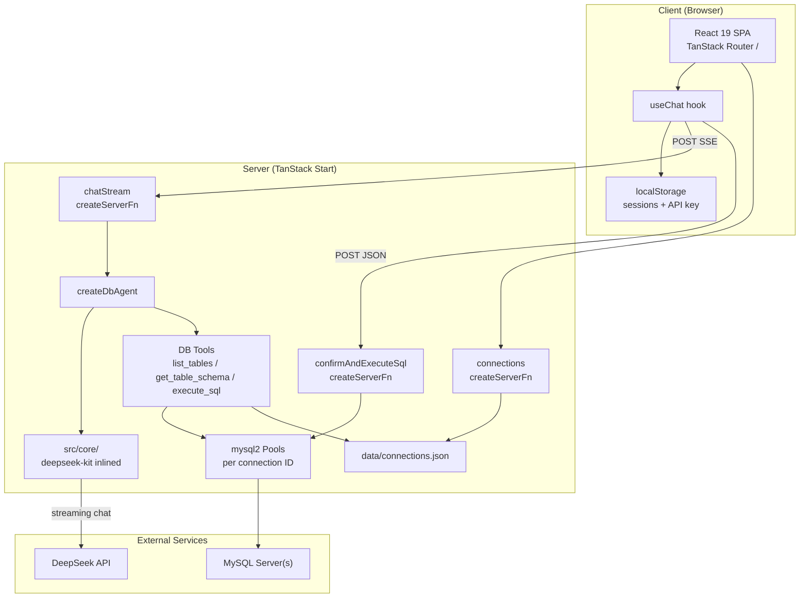
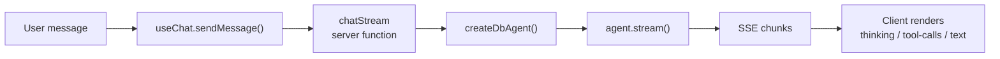
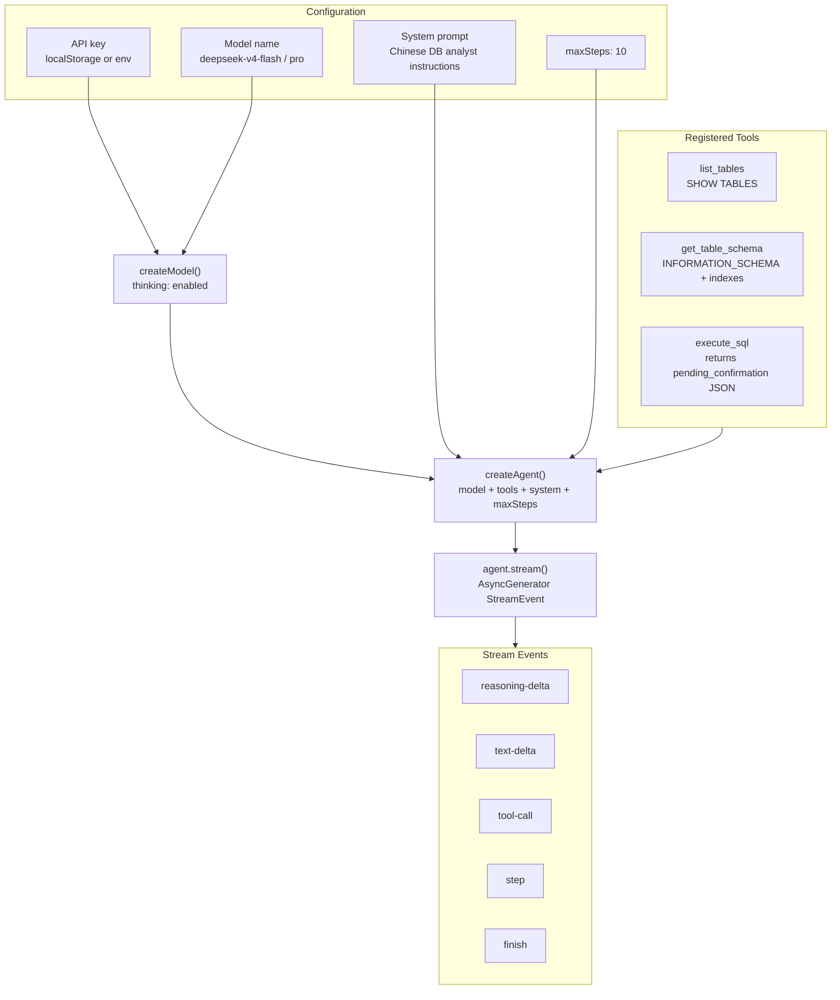
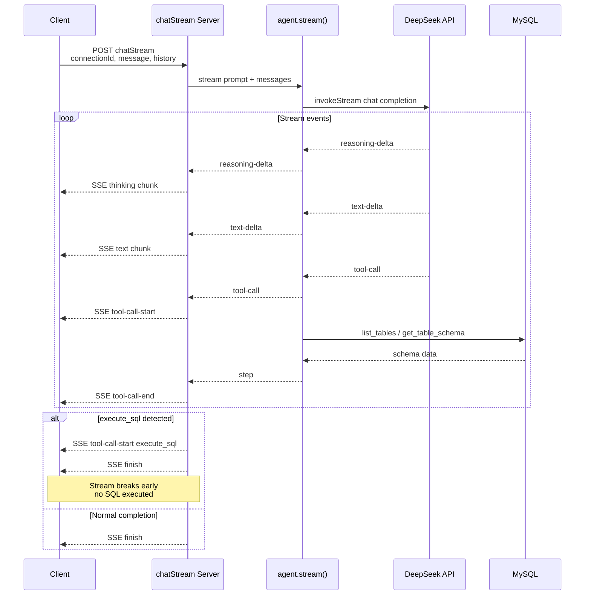
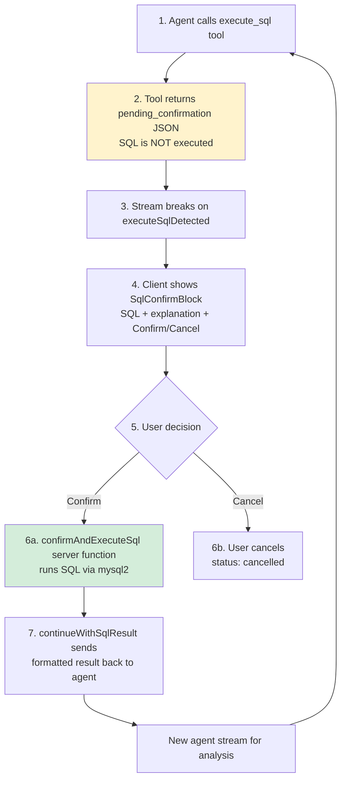
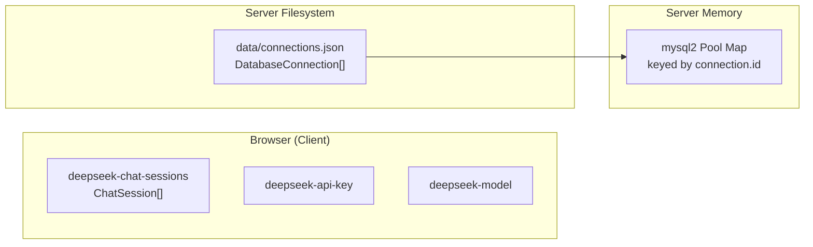

# DeepSeek-Native DB Chat2SQL Agent — Architecture

DeepSeek-Native DB Chat2SQL Agent is an AI-powered MySQL assistant that lets users ask natural-language questions about their databases. The application combines a React 19 single-page client, TanStack Start server functions, an inlined DeepSeek agent runtime, and mysql2 connection pools to deliver streaming, tool-augmented database analysis with human-in-the-loop SQL execution.

---

## Table of Contents

1. [High-Level Architecture](#high-level-architecture)
2. [Technology Stack](#technology-stack)
3. [Request Flow](#request-flow)
4. [Agent Architecture](#agent-architecture)
5. [SSE Streaming Architecture](#sse-streaming-architecture)
6. [Human-in-the-Loop SQL Flow](#human-in-the-loop-sql-flow)
7. [Data Storage](#data-storage)
8. [Key Design Decisions](#key-design-decisions)
9. [Project Structure](#project-structure)

---

## High-Level Architecture

The application is a full-stack TypeScript monolith built on **TanStack Start**. The client is a React 19 SPA with a single route (`/`). The server exposes RPC-style endpoints via `createServerFn`. AI reasoning and tool orchestration run through an inlined copy of **deepseek-kit** core (`src/core/`). Database access uses **mysql2** connection pools, one pool per configured connection.



| Layer | Responsibility |
|-------|----------------|
| **Client** | Chat UI, session management, SSE consumption, SQL confirmation UI |
| **Server functions** | Stream orchestration, SQL execution after approval, connection CRUD |
| **Agent core (`src/core/`)** | Model invocation, multi-step agent loop, tool dispatch, stream events |
| **Database layer** | Connection pooling, schema introspection, query execution |

---

## Technology Stack

| Category | Technology |
|----------|------------|
| Framework | TanStack Start + TanStack Router |
| UI | React 19, Tailwind CSS 4 |
| AI runtime | Inlined deepseek-kit (`src/core/`) |
| LLM provider | DeepSeek API (thinking mode enabled) |
| Database driver | mysql2 (promise API, connection pools) |
| Validation | Zod |
| Streaming | Server-Sent Events (SSE) over HTTP |
| Build | Vite 6 |

---

## Request Flow

When a user sends a message, the client initiates an SSE stream. The server creates a database-scoped agent, streams DeepSeek events, maps them to client-facing chunks, and breaks early if the agent requests SQL execution (requiring human confirmation).



### Step-by-step

1. **User input** — `MessageInput` calls `useChat.sendMessage(content)`.
2. **Session update** — User and empty assistant messages are appended; history is built from prior message content.
3. **Server call** — `chatStream` is invoked with `connectionId`, `message`, `history`, `model`, and `apiKey`.
4. **Agent creation** — `createDbAgent` loads the connection from `data/connections.json`, builds the model (with thinking enabled), registers DB tools, and attaches the system prompt.
5. **Streaming loop** — `agent.stream()` yields events (`reasoning-delta`, `text-delta`, `tool-call`, `step`, `finish`). The server maps these to `StreamChunk` types and writes SSE frames.
6. **Early termination** — If `execute_sql` is detected, the stream breaks after emitting `tool-call-start` so the client can show the confirmation UI before any SQL runs.
7. **Client rendering** — `ThinkingBlock`, `ToolCallStatus`, and markdown text update incrementally on the assistant message bubble.

---

## Agent Architecture

The agent is assembled in `src/server/agent.ts` from three primitives provided by the inlined core: `createModel`, `createAgent`, and `tool`.



### Tools

| Tool | Executes SQL? | Behavior |
|------|---------------|----------|
| `list_tables` | Yes (read-only) | Returns all table names via `SHOW TABLES` |
| `get_table_schema` | Yes (read-only) | Returns columns, types, keys, defaults, comments, and indexes for a named table |
| `execute_sql` | **No** | Returns a JSON payload with `status: "pending_confirmation"`, the proposed SQL, and an explanation. Does not touch the database. |

Tool results for `list_tables` and `get_table_schema` are pushed into a per-request `resultStore` (`Map<string, string[]>`) so the server can emit `tool-call-end` SSE events after each agent step. The `execute_sql` result is intentionally withheld from the client stream (`displayResult = ''`) to avoid leaking the raw pending-confirmation payload into the UI; the client instead reads SQL and explanation from the `tool-call-start` args.

### Agent loop

The core `generateStream` function runs an agent loop (up to `maxSteps`):

1. Stream a model step from the DeepSeek API.
2. If the model emits tool calls, execute them and append tool results to the message history.
3. Repeat until the model finishes without tool calls, or `maxSteps` is reached.
4. Yield normalized `StreamEvent` objects throughout.

Thinking mode is always enabled (`thinking: { type: 'enabled' }`), so the model can emit `reasoning_content` deltas that become visible "thinking" blocks in the UI.

---

## SSE Streaming Architecture

The server returns a raw `Response` with `Content-Type: text/event-stream`. Each event is a JSON object prefixed with `data: ` and terminated by a blank line.



### Event mapping

| DeepSeek / Agent Event | SSE `StreamChunk` Type | Client handling |
|------------------------|------------------------|-----------------|
| `reasoning-delta` | `{ type: "thinking", content }` | Appended to `message.thinking` |
| `text-delta` | `{ type: "text", content }` | Appended to `message.content` |
| `tool-call` | `{ type: "tool-call-start", name, args }` | Added to `message.toolCalls` |
| `step` (after tool exec) | `{ type: "tool-call-end", name, result }` | Marks tool call completed |
| Loop end | `{ type: "finish" }` | Finalizes in-progress tool calls |
| Error | `{ type: "error", message }` | Appended to message content |

The client parses SSE via `parseSSEStream()` in `useChat.tsx`, which reads the response body with a `ReadableStream` reader and yields parsed JSON chunks.

---

## Human-in-the-Loop SQL Flow

SQL execution is deliberately separated from the agent stream. The agent proposes SQL; the user must confirm before the server runs it against MySQL.



### Detailed flow

1. **Tool invocation** — The model calls `execute_sql` with `{ sql, explanation }`.
2. **Pending confirmation** — The tool handler returns:
   ```json
   {
     "status": "pending_confirmation",
     "sql": "...",
     "explanation": "...",
     "message": "已提交给用户确认。请立即停止..."
   }
   ```
3. **Stream break** — `chatStream` sets `executeSqlDetected = true` and exits the event loop after emitting `tool-call-start` for `execute_sql`.
4. **UI prompt** — `useChat.processStream` captures SQL args from the `tool-call-start` chunk and attaches `sqlConfirm: { status: "pending" }` to the assistant message. `SqlConfirmBlock` renders the proposal.
5. **User confirms** — `confirmSql()` calls `confirmAndExecuteSql`, which runs the query through `executeQuery()` (with a 30-second timeout).
6. **Result feedback** — On success, the result is stored on the message (`sqlResult`) and `continueWithSqlResult()` sends a synthetic user-style prompt containing the SQL, row count, and up to 50 rows of data back through `chatStream` for further analysis.
7. **Error recovery** — On failure, `continueWithSqlError()` sends the error message so the agent can revise the SQL (typically after re-checking schema with `get_table_schema`).
8. **Multi-step queries** — The system prompt instructs the agent to call `execute_sql` at most once per turn and wait for results before proposing the next query.

This design ensures that destructive or incorrect SQL never runs without explicit user approval.

---

## Data Storage



| Data | Location | Format | Notes |
|------|----------|--------|-------|
| Chat sessions | Browser `localStorage` (`deepseek-chat-sessions`) | JSON array of `ChatSession` | Last 100 messages per session retained on save |
| API key | Browser `localStorage` (`deepseek-api-key`) | Plain string | Sent to server per request; falls back to `DEEPSEEK_API_KEY` env var |
| Model preference | Browser `localStorage` (`deepseek-model`) | String | Default: `deepseek-v4-flash` |
| Database connections | Server `data/connections.json` | JSON array | Host, port, user, password, database name |
| Connection pools | Server in-memory `Map` | mysql2 `Pool` | Created lazily per connection ID; max 5 connections per pool |

There is **no server-side chat persistence** and **no user account system**. All conversation history lives in the user's browser. Database credentials are stored server-side in the connections file (the deployment should restrict filesystem access accordingly).

---

## Key Design Decisions

### 1. Inlined deepseek-kit (`src/core/`)

The DeepSeek agent SDK is vendored directly into the repository rather than consumed as an external npm package.

**Why:**

- **Native thinking mode** — DeepSeek models expose `reasoning_content` in streaming deltas. The inlined core maps these to `reasoning-delta` events without adapter layers.
- **Reasoning content management** — The generate loop correctly threads reasoning tokens through multi-step tool calls.
- **Cache hit optimization** — The core can leverage DeepSeek's prompt caching semantics across agent steps.
- **Full control** — Tool dispatch, retry logic, and stream normalization can be tuned for this app's DB-assistant workflow.

### 2. SSE over WebSocket

Streaming uses HTTP Server-Sent Events rather than a persistent WebSocket.

**Why:**

- **Simpler infrastructure** — SSE works over standard HTTP POST responses; no separate WS upgrade path.
- **Unidirectional flow** — Chat streaming is server-to-client after an initial POST; SSE matches this pattern naturally.
- **TanStack Start compatibility** — `createServerFn({ response: 'raw' })` returns a `ReadableStream` Response cleanly.

### 3. Human-in-the-loop SQL execution

The `execute_sql` tool does not run queries. A separate `confirmAndExecuteSql` server function handles execution after explicit user approval.

**Why:**

- **Safety** — LLMs can hallucinate table or column names, generate overly broad queries, or propose destructive statements.
- **Transparency** — Users see the exact SQL and explanation before anything touches the database.
- **Auditability** — Confirmation state (`pending`, `confirmed`, `executed`, `cancelled`, `error`) is tracked on each message.

### 4. localStorage for user data

Chat history and API keys are stored in the browser, not on the server.

**Why:**

- **Privacy-first** — Conversations never leave the user's machine (except when sent to DeepSeek for inference).
- **Zero server dependency** — No database, auth system, or session store required for chat functionality.
- **Instant persistence** — Sessions survive page reloads without backend round-trips.

---

## Project Structure

```
deepseek-db-chat/
├── src/
│   ├── core/                  # Inlined deepseek-kit: model, agent, tools, streaming
│   ├── server/
│   │   ├── agent.ts           # createDbAgent — model + tools + system prompt
│   │   ├── tools.ts           # list_tables, get_table_schema, execute_sql
│   │   ├── database.ts        # mysql2 pools, query execution, schema introspection
│   │   ├── store.ts           # connections.json CRUD
│   │   └── functions/
│   │       ├── chat.ts        # chatStream SSE endpoint
│   │       ├── confirm-sql.ts # confirmAndExecuteSql
│   │       └── connections.ts # connection management API
│   ├── hooks/
│   │   ├── useChat.tsx        # Chat state, SSE parsing, SQL confirm flow
│   │   ├── useDatabase.tsx    # Active connection selection
│   │   └── useSettings.tsx    # API key and model (localStorage)
│   ├── components/
│   │   ├── chat/              # MessageList, SqlConfirmBlock, ThinkingBlock, etc.
│   │   └── layout/            # Sidebar, DatabaseList, ApiKeyDialog
│   ├── routes/
│   │   └── index.tsx          # Single route "/"
│   └── lib/
│       ├── types.ts           # ChatMessage, StreamChunk, SqlResultInfo, etc.
│       └── constants.ts       # Model defaults, timeouts, file paths
├── data/
│   └── connections.json       # Server-side DB connection configs
└── docs/
    └── architecture.md        # This document
```

---

## Related Server Functions

| Function | Method | Purpose |
|----------|--------|---------|
| `chatStream` | POST (raw SSE) | Stream agent responses for a user message |
| `confirmAndExecuteSql` | POST (JSON) | Execute approved SQL against the active connection |
| Connection CRUD | POST (JSON) | Add, list, test, and remove database connections |

These are invoked from the client via TanStack Start's `createServerFn` RPC layer, which handles serialization and routing automatically.
